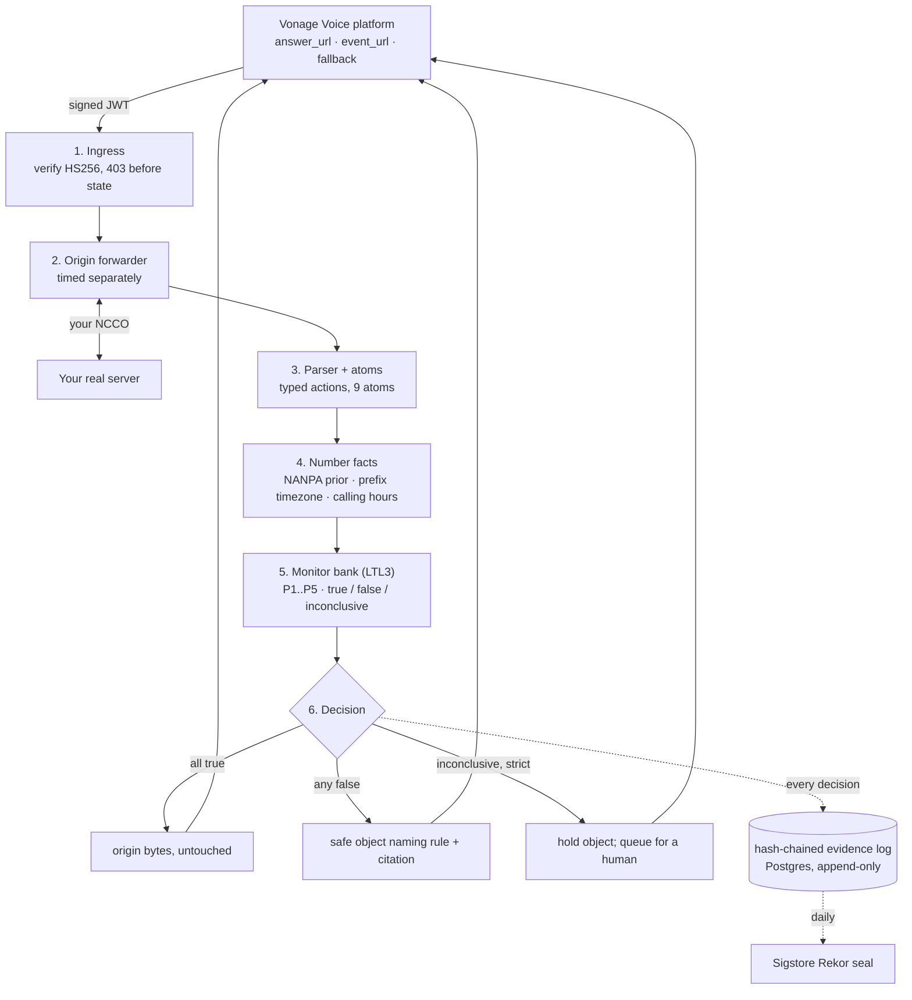

# PREFLIGHT

**The call that doesn't happen.**

Preflight is a pre-dial compliance interlock for the Vonage Voice API. It sits inside your own Vonage
account, in the call-control path, reads the call flow your server is about to serve, runs monitors
compiled from the federal and Georgia telemarketing rules over it, and stops the call before the
carrier is ever asked to place it if that flow would break the law. No model decides. A three-valued
monitor built from the statute does, and it holds rather than guesses.

[](https://github.com/StephenSook/preflight/actions/workflows/ci.yml)
[](./LICENSE)
[](./packages)
[](./.nvmrc)
[](./tsconfig.base.json)
[](https://developer.vonage.com/en/voice/voice-api/overview)

Built for the DIALED IN Builder Challenge (CreateHER Fest x Vonage, Atlanta cohort). This README
describes what runs today; anything not yet built is listed under [Honest status](#honest-status),
never implied.

> **The sentence a judge should be able to repeat.** It read the call flow the server was about to
> serve, decided it would break federal law, and stopped the call before the network ever saw it.

## The problem

A developer ships a call flow with a branch nobody traced. That branch reaches a synthesized voice on
a wireless number without consent, and liability accrues at 500 USD per call rather than per campaign
(47 U.S.C. 227(b)(3), trebled at the court's discretion). Every incumbent compliance product answers
one question: may I dial this number? They scrub lists. None of them looks at the call flow itself,
and the platform that executes the flow ships documentation instead of a checker, because being wrong
is expensive for a platform in a way it is not for a tool the caller runs themselves. Preflight is
that tool.

## What it does

Three fields change in your Vonage application: `answer_url`, `event_url` and `fallback_answer_url`
point at Preflight instead of at your server, and Preflight is told where your real server lives.
Nothing else changes. Then, on every call:

1. Vonage calls Preflight with a signed JWT. Preflight verifies the signature (HS256 against the
   per-application secret, selected by the `api_key` claim, with the payload hash checked) and rejects
   anything unsigned with 403 before touching any state.
2. Preflight forwards the request unchanged to your real answer URL and times that round trip
   separately from its own work, so a slow origin is never blamed on the interlock.
3. Your server responds with its NCCO. Preflight parses it into typed actions and reads the atom
   vocabulary off each one (speaks, synthetic, identifies, offers_optout, connects_human).
4. Preflight resolves facts about the person on the line: state, rate center and a line-type prior
   from the NANPA central office code file, the timezone from the number prefix, and whether the
   call falls inside 8am to 9pm at their location.
5. Every armed monitor runs over the path. Verdicts are true, false or inconclusive.
6. All true: the origin's bytes pass through untouched. Any false: the call is blocked and a safe
   object is returned that names the rule and the citation. Any inconclusive under strict policy:
   the call is held, because a monitor that cannot decide does not guess.
7. Every decision is appended to a hash-chained evidence log whose head is sealed to Sigstore Rekor
   once a day, so a third party who does not trust the operator can verify it.

## Preflight in one loop

> A call list and a running application go in. Every call whose flow would reach a prohibited state is
> blocked before dial, the rest are placed, and a signed log comes out naming what was blocked and
> under which rule. The developer opens a blocked row, reads the exact action path that would have
> reached the prohibited state, fixes the flow, and the same number rings.

## The property set

Tier 1 is mechanically verified from the call-control object plus number facts, armed by default, and
a false verdict blocks the call. The formulas are LTL over the atom vocabulary and live in
[`packages/engine/src/properties.ts`](./packages/engine/src/properties.ts).

| ID | Property | What Preflight checks, structurally | Citation |
|---|---|---|---|
| P1 | Calling hours | Every spoken action happens inside 8am to 9pm at the destination, resolved from the number prefix to a timezone against the call timestamp. `G( speaks -> within_hours )` | 47 CFR 64.1200(c)(1) |
| P2 | Identification present | No synthetic speech with no live human leg occurs strictly before the declared identification beat. `(!(speaks & synthetic & !connects_human)) W identifies` | 47 CFR 64.1200(b)(1) |
| P3 | Interactive opt-out present | From every synthetic-speech action, an input action declared as the opt-out handler is reachable later on the path. `G( (speaks & synthetic & !connects_human) -> F offers_optout )` | 47 CFR 64.1200(b)(3) |
| P4 | Caller ID integrity | A valid, non-suppressed caller id is set on the call. `G( caller_id_present )` | O.C.G.A. 46-5-27(c) |
| P5 | Georgia identification first | Nothing is spoken strictly before the declared identification beat. Position, not presence. `(!speaks) W identifies` | O.C.G.A. 46-5-27(b); Ga. Comp. R. & Regs. 515-14-1-.03(b) |

Two of these atoms come from what the developer declares about their own flow (which spoken beat
identifies the caller, which input collects a do-not-call request), matched structurally by phrase,
stream URL or event URL. Preflight never judges whether the words spoken are truthful. Without a
declaration nothing identifies and nothing offers opt-out, which is the fail-closed default.

**The sentence that appears in the interface.** Preflight verifies the structure of your call flow
against a published set of rules. It does not verify consent, business relationships, or the content
of what is spoken. It is a compliance tool, not legal advice, and it does not create an
attorney-client relationship. Coverage is reported as endpoints observed, and a branch never
exercised has never been checked.

## What is real

Every row names the file where the behavior lives. Nothing in this table is a scaffold.

| Component | Shipped behavior | Where |
|---|---|---|
| Signed-webhook ingress | HS256 verification with `@vonage/jwt`, secret selected by `api_key`, payload hash checked, 403 before any state is touched | `apps/api/src/vonage/verifyWebhook.ts` |
| Origin forwarder | Byte-exact pass-through, origin latency timed separately, fail-closed safe object on timeout | `apps/api/src/proxy/forward.ts`, `apps/api/src/server.ts` |
| NCCO parser | Typed actions for talk, stream, input, connect, notify, record, conversation, pay; never throws; every defect is an issue with a path; an untypable action stays in position as `unknown` | `packages/engine/src/ncco/parse.ts` |
| Atom extraction | The five action atoms and four call atoms, declaration-driven, unresolved facts stay null | `packages/engine/src/ncco/atoms.ts` |
| LTL3 monitor construction | Hand-built from Bauer, Leucker and Schallhart (2011): LTL to Büchi by the Gerth, Peled, Vardi, Wolper tableau, per-state emptiness, subset construction of the property and its negation, product, three-valued labelling, Moore minimisation. One table lookup per step. Zero dependencies. | `packages/engine/src/ltl/` |
| Properties and evaluator | P1 to P5 compiled once per process; a path evaluates to verdicts plus the exact witness path on any false; open branches hold; terminal paths get the definite end-of-flow verdict | `packages/engine/src/properties.ts`, `packages/engine/src/evaluate.ts` |
| Number facts | 204,776 NPA-NXX rows from the NANPA central office code file with state, rate center, operating company and a line-type prior; timezone by longest prefix from libphonenumber's map (2,046 entries); calling hours are three-valued when a prefix spans zones | `packages/numfacts/` |
| Decision layer | Pass, block or hold per call; the person on the line is the callee of an outbound call or the caller of an inbound one; strict policy holds on inconclusive, advisory passes with a warning; an object that is not an NCCO is blocked under either | `apps/api/src/decide/answer.ts` |
| Evidence log | Canonical JSON, sha256 hash chain from genesis, a Postgres table that refuses UPDATE and DELETE twice over (revoked grants plus a trigger), advisory-locked appends, public `head`, `entries` and `verify` endpoints | `packages/ledger/`, `apps/api/src/store/ledgerStore.ts`, `apps/api/src/db/migrations/0003_ledger.sql` |
| Transparency-log seal | Daily workflow signs the chain head with a P-256 key, uploads a `hashedrekord` to Sigstore Rekor, verifies it back from the public log, and records the seal in the ledger | `.github/workflows/seal.yml`, `packages/ledger/keys/preflight-ledger-public.pem` |
| Event store | Every signed event webhook body persisted with its received-at timestamp, the raw material for the rate properties | `apps/api/src/store/pgEventStore.ts` |

## Architecture



Two decisions shape everything: the answer webhook has five seconds, and Preflight is in series with
your server inside that budget, so verification is a bounded traversal plus one local table lookup,
never a network call. And the graph of a real call flow is distributed across your webhook handlers
(an `input` or `notify` callback can return a replacement object), so it cannot be known from any
one document; an open branch is held until it has been observed.

## Two corrections to the specification, found by construction

The product specification was written before the code. Building it found two defects, both recorded
with the check that found them in [`docs/fact-sheet.md`](./docs/fact-sheet.md):

- **Answer-webhook timing.** Vonage fires the answer webhook when a call is answered, so a
  webhook-only interlock cannot keep an outbound phone silent. Outbound calls need a create-call
  gateway that pre-fetches and verifies the flow before the request reaches the platform.
- **The P2 and P5 formulas.** The spec wrote them as `!( !identifies U speaks )`, which is false on
  every compliant flow because the identification beat itself speaks. Weak until is the correct
  encoding, and the monitor test suite pins both the defect and the fix.

## Repo layout

```
apps/api/            Fastify service: ingress, forwarder, decision layer, stores, ledger endpoints, migrations
apps/web/            Vite front end (dashboard and public site; in progress)
apps/reference/      the deliberately non-compliant reference application (in progress)
packages/engine/     NCCO parser, atoms, LTL parser, LTL3 monitor construction, properties, evaluator
packages/numfacts/   NANPA table, prefix timezone map, calling-hours resolver, committed data + manifest
packages/ledger/     canonical JSON, hash chain, verification, the public seal key
packages/rules/      statute text and citation enforcement (in progress)
packages/cli/        replay, verify-ledger, check (in progress)
corpus/ncco/         labelled call-control objects with expected atoms, verdicts and witness paths
scripts/             fetch-numfacts.mjs, ai-tone-gate.sh
spike/gate1/         the measurement rig that killed the previous candidate (kept as evidence)
docs/                fact sheet (single source for every number on every surface)
.github/workflows/   ci.yml, seal.yml
```

## Quickstart

Prerequisites: Node 22 and pnpm 10. A Postgres database is optional; without `DATABASE_URL` the
service runs on in-memory stores and says so on `/health`.

```bash
git clone https://github.com/StephenSook/preflight.git
cd preflight
pnpm install --frozen-lockfile
cp .env.example .env            # fill in the Vonage values from your dashboard
pnpm dev:api                    # http://localhost:3131/health
```

Point a Vonage application's answer, event and fallback URLs at `/v/answer`, `/v/event` and
`/v/fallback` on a public host, set `ORIGIN_ANSWER_URL` to your real server, and place a call.

```bash
pnpm test                       # every suite, 101 tests
pnpm verify:engine              # the engine suites alone, verbose
pnpm --filter @preflight/numfacts fetch   # refresh the number-facts tables from their sources
```

## Verification

CI runs on every push to `main`: lint, typecheck, the full vitest suite, an AI-tone gate over every
prose surface, gitleaks over the full history, and Socket's dependency report. The Postgres
integration suites (event store, decision store, ledger) run against a real database in CI and are
written to fail, never skip, when `DATABASE_URL` is missing.

The engine's own guarantees are tests, not claims:

- textbook LTL3 verdicts for G, F, U, X, R, GF, response and `G (a -> F b)`;
- verdicts are final: once true or false, every extension keeps the verdict, over random traces;
- a formula and its negation are complementary on every prefix and at every end of flow;
- the ten-object corpus carries expected atoms, verdicts, decision and witness path per file, so a
  reviewer checks a label by reading the object.

The evidence log is verifiable by anyone with the URL: `GET /api/ledger/verify` recomputes every
hash from genesis and reports the first broken entry, if any. The Rekor seal is verified with
`rekor-cli` against the committed public key; the exact command is printed by the seal workflow.

## Data sources and licenses

| Source | Used for | Terms |
|---|---|---|
| NANPA central office code assignments (`reports.nanpa.com`) | state, rate center, operating company, line-type prior | public, no account; derived table committed with sha256 and file date in `packages/numfacts/data/SOURCES.json` |
| libphonenumber `resources/timezones/map_data.txt` | prefix to timezone | Apache-2.0, The Libphonenumber Authors |
| eCFR (`ecfr.gov`) | 47 CFR 64.1200 text at a pinned date | U.S. Government work |
| Vonage Voice API reference | NCCO field names, webhook shapes, signed callbacks | documentation |

## Honest status

What is not built yet, so nobody has to guess:

- No public deployment yet. The API deploys to Render and the web app to Vercel once the Vonage
  credentials are in place; until then there is no live URL and no badge claims one.
- The dashboard (six screens over server-sent events), the public site, the browser sandbox and the
  softphone are not started.
- The create-call gateway (`POST /v/calls`), passive graph discovery with the coverage counter, the
  declared-versus-actual diff, the rate properties P6 to P8, Vonage Identity Insights as the paid
  line-type lookup, the Verify v2 consent gate, the reference application and the `npx preflight`
  CLI are planned and not present in the code. Wired or cut, at submission time.

## Honesty and limitations

- **Coverage is bounded by observed traffic.** A branch never exercised has never been checked, and
  the interface says so in its header rather than in a footnote.
- **An open path holds under strict policy.** The always-properties are never true on a finite prefix
  while a branch is unobserved; that is the honest LTL3 answer, and the held queue is where a human
  decides.
- **P3 can never return true on a prefix,** only false or inconclusive, because no finite observation
  proves that an opt-out will eventually be offered. It becomes definite only when the flow ends.
- **The line-type prior cannot see porting.** A number ported from a landline carrier to a wireless one
  still shows the original code holder; every NANPA-derived fact carries confidence "low".
- **A timezone from a prefix is a proxy for where the person is.** Mobile numbers travel. When a
  prefix spans zones and they disagree at that instant, calling hours are undecided and the call holds.
- **No Georgia penalty figure is printed.** The codified text after Senate Bill 73 conflicts with
  secondary sources on the amount; until the primary text is read, no number appears anywhere.
- **Not legal advice.** Structure and position are checked; consent, business relationships and the
  truth of what is spoken are declared by the developer and marked unverified.

## License

Apache-2.0. See [LICENSE](./LICENSE).
